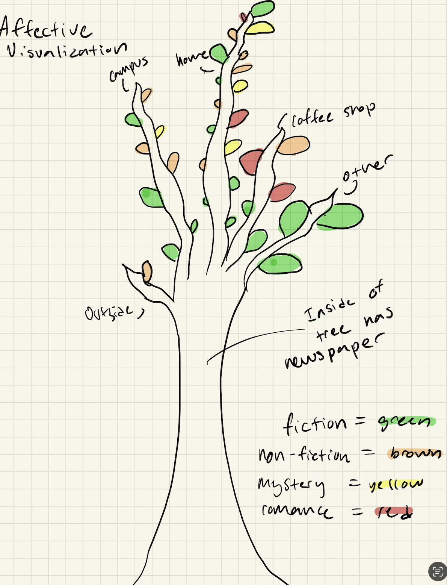
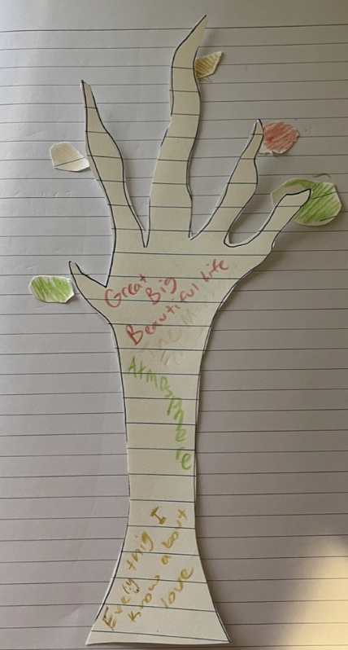
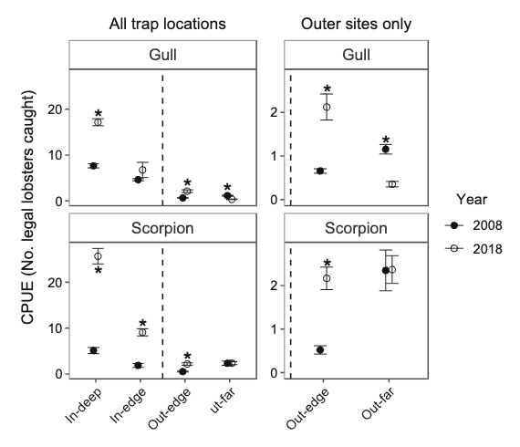

Link to my github: [Github Repository](https://github.com/maceyhartmann/ENVS-193DS_homework-03.git)

# Set Up

```{r}
#| label: Packages and Data
#| message: false
#| warning: false

# read in packages here
library(tidyverse) # general use
library(here) # file organization
library(janitor) # cleaning data frames

#read in data here
salinity <- read.csv(here("data", "salinity-pickleweed.csv")) # store salinity data as salinity object
my_data <- read_csv(here("data", "Personal_Data_ENVS194DS.csv")) # read in personal data and save as an object called my_data
```

# Problem 1. Slough soil salinity

## a. An appropriate test

The appropriate tests to determine the strength of the relationship between salinity and California pickleweed biomass are the Pearson's correlation (r) test and Spearman's rank correlation (p) test. The Pearson's correlation is a parametric test that measures the strength of the relationship between salinity and biomass and assumes that observations are independent and both variables are continuous and normally distributed with a linear relationship. The Spearman's rank correlation is non-parametric and measures the monotonic relationship between salinity and biomass for independent observations by evaluating whether the rank order of soil salinity values corresponds with the rank order of pickleweed biomass values (this test does not assume normality or a linear relationship).

## b. Create a visualization

```{r}
#| label: Visualization
#| message: false
# base layer: ggplot 
ggplot(data = salinity, # salinity data frame
       aes(x = salinity_mS_cm, # salinity on x axis
           y = pickleweed)) + # pickleweed biomass on y axis
  # first layer: scatterplot
  geom_point(size = 3, # larger points
             color = "firebrick4", # color red
             alpha = 0.5) + # slight transparency
  # graph and axis titles
  labs(x = "Soil Salinity (mS/cm)", # x axis title
       y = "Pickleweed Biomass (g)", # y axis title
       title = "Relationship between Soil Salinity and Pickleweed Biomass") + # graph title
  theme_minimal() # different theme than default
```

## c. Check your assumptions and run your test

### Check for linear relationship between variables and monotonic relationship between variables

```{r}
#| label: Visual Check
#| message: false
#| warning: false
# base layer: ggplot 
ggplot(data = salinity, # salinity data frame
       aes(x = salinity_mS_cm, # salinity on x axis
           y = pickleweed)) + # pickleweed biomass on y axis
  # first layer: scatterplot
  geom_point(size = 3, # larger points
             color = "firebrick4", # color red
             alpha = 0.5) + # slight transparency
  # graph and axis titles
  labs(x = "Soil Salinity (mS/cm)", # x axis title
       y = "Pickleweed Biomass (g)", # y axis title
       title = "Relationship between Soil Salinity and Pickleweed Biomass") + # graph title
  theme_minimal() # different theme than default
```

### Check that variables are continuous and normally distributed

```{r}
#| label: QQ-Plot_Salinity
#| message: false
#| warning: false
# base layer: ggplot call
ggplot(data = salinity, # starting data frame
       aes(sample = salinity_mS_cm)) + # y-axis for QQ plot (no x-axis)
  # first layer: QQ reference line 
  geom_qq_line(color = "blue") + # color the QQ reference line blue 
  # second layer: QQ plot
  geom_qq() + 
  labs(title = "QQ Plot Salinity", # descriptive title
    x = "Theoretical Quantiles", # x axis label
    y = "Sample Quantiles") + # y axis label
  theme_light() # applying a new theme
```

```{r}
#| label: QQ-Plot-Pickleweed
#| message: false
#| warning: false
# base layer: ggplot call
ggplot(data = salinity, # starting data frame
       aes(sample = pickleweed)) + # y-axis for QQ plot (no x-axis)
  # first layer: QQ reference line 
  geom_qq_line(color = "blue") + # color the QQ reference line blue 
  # second layer: QQ plot
  geom_qq() + 
  labs(title = "QQ Plot Pickleweed Biomass", # descriptive title
    x = "Theoretical Quantiles", # x axis label
    y = "Sample Quantiles") + # y axis label
  theme_light() # applying a new theme
```

To determine whether Pearson's or Spearman's correlation was appropriate, I checked two assumptions: (1) that the relationship between soil salinity (mS/cm) and pickleweed biomass (g) was linear and monotonic, and (2) that both variables were continuous and approximately normally distributed. I checked the linearity assumption visually using a scatterplot, and assessed normality using QQ plots for both soil salinity and pickleweed biomass. Both QQ plots showed points falling reasonably close to the reference line with no major deviations, and the scatterplot suggested a positive linear trend, indicating that the assumptions for Pearson's correlation were sufficiently met.

### Run Pearsons Correlation Test between soil salinity and pickleweed biomass
```{r}
#| label: Pearsons Correlation
#| message: false
#| warning: false
cor.test(salinity$salinity_mS_cm, # soil salinity (mS/cm) as first variable
         salinity$pickleweed, # pickleweed biomass (g) as second variable
         method = "pearson") # specifying Pearson's correlation as the method
```

## d. Results communication

To evaluate the strength of the relationship between pickleweed biomass and soil salinity, I used a Pearson's correlation test because both variables are continuous, approximately normally distributed based on the QQ plots, and the scatterplot suggested a linear relationship between the two variables. There is a statistically significant, moderate positive correlation between soil salinity and California pickleweed biomass, meaning that pickleweed biomass tends to increase as soil salinity increases (Pearson's r = 0.53, t(21) = 2.90, p = 0.009, ⍺ = 0.05).

## e. Test implications

Our analysis found a moderate positive relationship between soil salinity and pickleweed biomass, suggesting that plants growing in saltier soils tend to produce more biomass. This means that when selecting planting locations along the slough, prioritizing areas with higher soil salinity may support better pickleweed growth and restoration success. However, since this relationship is moderate rather than strong, other factors beyond salinity are likely also influencing plant growth and should be considered when making planting decisions.

## f. Double check your work 

```{r}
#| label: Spearmans Correlation
#| message: false
#| warning: false
# run Spearman rank correlation
cor.test(salinity$salinity_mS_cm, # soil salinity (mS/cm) as predictor
         salinity$pickleweed, # pickleweed biomass (g) as response
         method = "spearman") # specifying Spearman's correlation as the method
```

Both Pearson's correlation (r = 0.53, p = 0.009) and Spearman's rank correlation (ρ = 0.59, p = 0.003) led to the same decision to reject the null hypothesis that there is no relationship between soil salinity and pickleweed biomass. Both tests indicated a moderate positive relationship between the two variables, suggesting that as soil salinity (mS/cm) increases, pickleweed biomass (g) tends to increase as well. While Pearson's evaluated the linear relationship between the raw values of the two variables, Spearman's evaluated the monotonic relationship between their rank orders, yet both arrived at the same conclusion.

# Problem 2. Personal Data 

## a. Updating your visualizations
```{r}
#| label: clean-personal-data
#| message: false
my_clean_data <- my_data |> # create object my_clean_data from my_data
  clean_names()
```

### Visualization of reading location (categorical predictor variable) vs pages read (response variable)
```{r}
#| label: personal-categorical-data
#| message: false
# base layer: ggplot 
ggplot(data = my_clean_data, # use clean data
       aes(x = reading_location, # categorical predictor on x-axis
           y = pages_read, # response variable on y - axis 
           color = reading_location # give each reading_location a different color 
           )) + 
# first layer: boxplot 
geom_boxplot() + 
# second layer: jitter plot 
geom_jitter (height = 0, # no vertical jitter
             width = 0.2) + # narrowing width of jitter
labs(x = "Reading Location", # x-axis title
     y = "Pages Read", # y-axis title
     title = "Pages Read by Reading Location", # graph title
      subtitle = "Most recent observation: Februrary 28, 2026") + # most recent date)
   scale_color_brewer(palette = "Dark2") + # use Dark2 color palette from colorbrewer project
  theme_minimal() + # set theme different from default 
  theme(legend.position = "none") # remove legend
```

### Visualization of reading duration (continuous predictor variable) vs pages read (response variable)

```{r}
#| label: personal-continuous-data
#| message: false
#base layer: ggplot 
ggplot(data = my_clean_data, # use my_clean_data
       aes(x = reading_duration, # continuous predictor variable on x-axis
            y = pages_read)) + # response variable on y-axis
# first layer: Add scatterplot points
  geom_point(color = "blue1", # use different color than default 
             size = 3, # set point size
             alpha = 0.7) + # make points more transparent
   labs(x = "Reading Duration (minutes)", # x-axis title
       y = "Pages Read", # y-axis title
       title = "Longer Reading Sessions Lead to More Pages Read", # graph title
      subtitle = "Most recent observation: Februrary 28, 2026") + # most recent date
   theme_bw() # change theme from default
```

## b. Captions

**Figure 1. Pages Read Varies Widely Across Reading Locations** The distribution of pages read by reading location (campus, coffee shop, home, other, and outside) across reading sessions is represented by the boxplot. Each point represents a reading session. Reading sessions in "other" locations had the highest median pages read (around 63 pages), while home reading sessions showed the most variability and lowest median (around 15 pages).

**Figure 2. Longer Reading Sessions Consistently Produce More Page** The relationship between reading duration (minutes) and pages read across all reading sessions is represented in a scatterplot. The most recent observation was February 28, 2026, and each blue point represents a reading session.

# Problem 3. Affective Visualization 

## a. Describe in words what an affective visualization could look like for your personal data (3-5 sentences).

My affective visualization will take the form of a tree, where each major branch represents a different reading location (home, campus, coffee shop, and other). Along each branch, individual leaves will grow to represent reading sessions, with the size of each leaf corresponding to the number of pages read during that session (larger leaves indicating more productive reading sessions). The leaves will be colored by book genre, with each genre (fiction, non-fiction, mystery, and romance) assigned a distinct color, allowing the viewer to see patterns in where and what I tend to read. The leaves will extend across the branch in chronological order from bottom to top, so the tree also tells a story of my reading habits over time. The tree trunk will have the names of the books I read, colored by genre. 

## b. Create a sketch of your idea


## c. Make a draft of your visualization 


## d. Write an artist statement 

Content: This piece visualizes my personal reading habits over the course of January and February 2026, using a tree as a metaphor for growth and knowledge. Each branch represents a reading location (home, campus, coffee shop, and other), and each leaf encodes an individual reading session. Leaf size reflects pages read and leaf color represents book genre (fiction, non-fiction, mystery, and romance).

Influences: I was inspired by Stefanie Posavec and Giorgia Lupi's Dear Data project, which demonstrated how personal data could be turned into visualizations. I was also drawn to the symbolism of trees as vessels of knowledge, which felt like a fitting form for data about reading.

Form: This piece is a hand-drawn and watercolor illustration on paper, using ink for the tree structure and watercolor washes for the leaves.

Process: I began by organizing my data by reading location and sorting sessions chronologically, then sketched the tree structure with four main branches. I drew individual leaves along each branch in chronological order from bottom to top, sizing each leaf by pages read and painting them with watercolor in four genre-based colors. A legend in the corner keys the colors to their corresponding genres.

## e. Prep your materials to share in class 
[View slides here](https://docs.google.com/presentation/d/1w05SoDtWxivCA1DPgmQzBUhx5J-jd5SI0EE-QNFI4Go/edit?usp=sharing)

# Problem 4. Statistical Critique 

## a. Revisit and Summarize
The statistical test is Welch's t-test. There is one response variable that is measured in two different ways: either as catch per unit effort (CPUE; number of legal-sized lobsters per trap) OR as weight per trap (kg). These are separate analyses of the same basic response (lobster abundance/biomass in traps). The predictor variable is year (2008 vs. 2018), compared across different spatial locations relative to marine reserve borders (in-deep, in-edge, out-edge, out-far).



## b. Visual Clarity 
Figure 3 represents the statistical results clearly and logically. The x-axis displays trap location categories ordered spatially from inside to outside the reserve (in-deep, in-edge, out-edge, out-far), which intuitively reflects the biological gradient of spillover being tested, and the y-axis shows mean CPUE in number of legal lobsters caught per trap. The authors display summary statistics effectively by showing means with standard error bars for both years (2008 as closed circles, 2018 as open circles), and the use of asterisks to denote statistical significance from Welch's t-tests allows the reader to quickly identify which comparisons were significant. However, the figure does not show the underlying raw data distributions, which makes it difficult to assess the spread and skewness of the data. A violin or jitter plot overlay would have provided a more complete picture of the data underlying the test results.

## c. Aesthetic Clarity
Figure 3 has relatively good data-to-ink and ratiohandles visual clutter well overall. The figure uses a clean white background with minimal gridlines, and the simple closed and open circle design effectively distinguishes between the two years without requiring color. The decision to split the figure into two panels (one showing all trap locations and one zooming in on outer sites only) is a smart design choice that prevents crowding and draws attention to the spillover effect at reserve borders without sacrificing the broader spatial context. The only potential source of unnecessary clutter is the duplication of the out-edge and out-far data across both panels, but this redundancy is justified given how ecologically important the outer sites are to the paper's main argument.

## d. Recommendations
I would recommend adding the underlying raw data as a jitter layer behind the mean and standard error points, as the current figure only shows summary statistics and obscures the distribution and spread of the raw trap-level CPUE values, which is particularly important given that the authors note most data were non-normal and skewed. I would also recommend using color to distinguish between the two years (for example, a muted blue for 2008 and a warm orange for 2018) rather than relying solely on open versus closed circles, which can be difficult to distinguish at small figure sizes or in print. Finally, I would add a shaded rectangle or background color to clearly delineate the reserve boundary region on the x-axis, visually reinforcing the inside-versus-outside distinction that is central to the paper's argument about spillover, rather than relying solely on the dashed vertical line which is easy to overlook.


